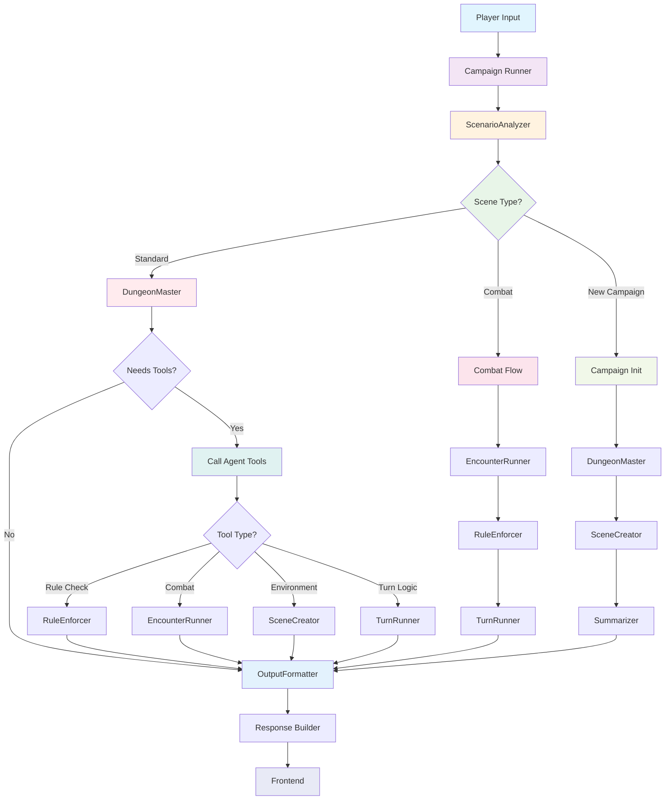

# Gaia AI Agent Architecture

## Table of Contents
- [Overview](#overview)
- [Agent Hierarchy](#agent-hierarchy)
- [Agent Flow Diagrams](#agent-flow-diagrams)
- [Agent Specifications](#agent-specifications)
- [Communication Patterns](#communication-patterns)
- [Execution Lifecycle](#execution-lifecycle)
- [Integration Points](#integration-points)

## Overview

Gaia uses a **multi-agent AI system** built on the OpenAI Agents framework. Each agent is specialized for specific D&D campaign management tasks, working together to create a comprehensive dungeon master experience.

### Core Design Principles
- **Specialization**: Each agent has a focused responsibility
- **Coordination**: Agents work together through the orchestrator
- **Context Sharing**: Shared game state across all agents
- **Async Execution**: Non-blocking agent operations
- **Tool Integration**: Agents can call each other as tools

## Agent Hierarchy

```
                    ┌─────────────────────────────────┐
                    │       Unified Orchestrator      │
                    │     (Agent Coordination)        │
                    └─────────────┬───────────────────┘
                                  │
                    ┌─────────────▼───────────────────┐
                    │       Session Management       │
                    │     (Campaign Execution)       │
                    └─────────────┬───────────────────┘
                                  │
        ┌─────────────────────────┼─────────────────────────┐
        │                         │                         │
┌───────▼──────┐        ┌────────▼─────────┐        ┌──────▼──────┐
│   Primary    │        │   Analysis &     │        │  Utility &  │
│   Agents     │        │   Validation     │        │  Support    │
└──────────────┘        └──────────────────┘        └─────────────┘
        │                         │                         │
┌───────▼──────┐        ┌────────▼─────────┐        ┌──────▼──────┐
│ DungeonMaster│        │ ScenarioAnalyzer │        │SceneCreator │
│ (Primary DM) │        │ (Scene Analysis) │        │(Environment)│
└──────────────┘        └──────────────────┘        └─────────────┘
        │                         │                         │
┌───────▼──────┐        ┌────────▼─────────┐        ┌──────▼──────┐
│EncounterRunner│       │  RuleEnforcer    │        │ Summarizer  │
│  (Combat)    │        │ (D&D Rules)      │        │(History)    │
└──────────────┘        └──────────────────┘        └─────────────┘
        │                         │                         │
┌───────▼──────┐        ┌────────▼─────────┐        ┌──────▼──────┐
│  TurnRunner  │        │OutputFormatter   │        │    Future   │
│ (Turn Logic) │        │(Response Format) │        │   Agents    │
└──────────────┘        └──────────────────┘        └─────────────┘
```

## Agent Flow Diagrams

### 1. **Standard Campaign Message Flow**

```
Player Input
     │
     ▼
┌─────────────────┐
│  Orchestrator   │ ◄─── Receives user message
└─────────┬───────┘
          │
          ▼
┌─────────────────┐
│ScenarioAnalyzer │ ◄─── Fast analysis (llama3.1:8b)
└─────────┬───────┘
          │ (complexity_score, recommendations)
          ▼
┌─────────────────┐
│ Dungeon Master  │ ◄─── Primary response (Claude 3.5)
└─────────┬───────┘
          │ (automatic handoffs to specialists)
          ▼
   ┌─────────────┐     ┌─────────────┐     ┌─────────────┐
   │RuleEnforcer │     │ TurnRunner  │     │SceneCreator │
   │  (if rules) │     │(if combat)  │     │(if environ) │
   └─────────────┘     └─────────────┘     └─────────────┘
          │                     │                     │
          └─────────────────────┼─────────────────────┘
                                ▼
                    ┌─────────────────┐
                    │OutputFormatter  │ ◄─── Formats response
                    └─────────┬───────┘
                              │
                              ▼
                    ┌─────────────────┐
                    │ Response Builder│ ◄─── Creates protocol response
                    └─────────┬───────┘
                              │
                              ▼
                         Frontend
```

### 2. **New Campaign Initialization Flow**

```
New Campaign Request
         │
         ▼
┌─────────────────┐
│  Orchestrator   │ ◄─── Handles new campaign
└─────────┬───────┘
          │
          ▼
┌─────────────────┐
│ Dungeon Master  │ ◄─── Creates initial setup
└─────────┬───────┘
          │ (calls tools for setup)
          ▼
   ┌─────────────┐     ┌─────────────┐
   │SceneCreator │     │ Summarizer  │
   │(environment)│     │ (context)   │
   └─────────────┘     └─────────────┘
          │                     │
          └─────────────────────┼─────────────────────┐
                                │                     │
                                ▼                     ▼
                    ┌─────────────────┐    ┌─────────────────┐
                    │OutputFormatter  │    │ History Manager │
                    └─────────┬───────┘    └─────────────────┘
                              │
                              ▼
                         Frontend
```

### 3. **Combat Encounter Flow**

```
Combat Action Input
         │
         ▼
┌─────────────────┐
│ScenarioAnalyzer │ ◄─── Detects combat scenario
└─────────┬───────┘
          │ (scene_type: "combat")
          ▼
┌─────────────────┐
│ Dungeon Master  │ ◄─── Orchestrates combat
└─────────┬───────┘
          │ (calls combat agents)
          ▼
┌─────────────────┐
│EncounterRunner  │ ◄─── Manages combat flow
└─────────┬───────┘
          │ (calls rule validation)
          ▼
┌─────────────────┐
│ RuleEnforcer    │ ◄─── Validates combat rules
└─────────┬───────┘
          │ (validated actions)
          ▼
┌─────────────────┐
│  TurnRunner     │ ◄─── Manages turn order
└─────────┬───────┘
          │ (turn results)
          ▼
┌─────────────────┐
│OutputFormatter  │ ◄─── Formats combat results
└─────────┬───────┘
          │
          ▼
                              Frontend
```

### 4. **Complete Agent Flow Diagram**



This comprehensive diagram shows:
- **Entry Point**: Player input flows through Orchestrator
- **Analysis Phase**: ScenarioAnalyzer determines the appropriate flow path
- **Three Main Flows**: Standard messages, combat encounters, and new campaigns
- **Tool Integration**: How DungeonMaster dynamically calls specialized agents
- **Convergence**: All paths lead to OutputFormatter for consistent response formatting
- **Final Output**: Structured response delivered to frontend

## Agent Specifications

### **Primary Agents**

#### 1. **DungeonMaster** (`dungeon_master.py`)
```
Role: Primary storytelling and campaign management
Model: Claude 3.5 Sonnet (claude-3-5-sonnet-20241022)
Responsibilities:
  ├── Narrative generation and storytelling
  ├── Player interaction handling
  ├── Rule interpretation and guidance
  ├── Campaign progression management
  └── Automatic handoffs to specialist agents

Handoff Capabilities:
  ├── Complex encounters → EncounterRunner
  ├── Rule disputes → RuleEnforcer
  ├── Combat turns → TurnRunner
  ├── Image generation → ImageGenerator
  └── Response formatting → OutputFormatter

Input: Player messages, campaign context
Output: Rich narrative responses with structured data
```

#### 2. **EncounterRunner** (`encounter_runner.py`)
```
Role: Complex multi-phase encounter management
Model: Claude 3.5 Sonnet (for complex scenarios)
Responsibilities:
  ├── Multi-phase encounter orchestration
  ├── Environmental hazards and challenges
  ├── Non-combat encounter management
  ├── Puzzle and trap execution
  └── Complex NPC interactions

Triggers:
  ├── Combat initiation
  ├── Attack rolls and damage
  ├── Spell casting in combat
  ├── Environmental hazards
  └── Monster behavior

Input: Combat actions, participant stats
Output: Combat results, initiative order, status effects
```

#### 3. **TurnRunner** (`turn_runner.py`)
```
Role: Turn-based game mechanics
Responsibilities:
  ├── Turn order management
  ├── Action economy tracking
  ├── Time-based effects
  ├── Round progression
  └── Action validation

Integration:
  ├── Called by EncounterRunner for combat turns
  ├── Used by DungeonMaster for structured gameplay
  └── Coordinates with RuleEnforcer for action validation
```

### **Analysis & Validation Agents**

#### 4. **ScenarioAnalyzer** (`scenario_analyzer.py`)
```
Role: Fast scene analysis and tool recommendation
Model: llama3.1:8b (for speed)
Responsibilities:
  ├── Complexity scoring (1-10)
  ├── Scene type identification (social/combat/exploration)
  ├── Player intent analysis
  ├── Tool and approach recommendations
  └── Quick context assessment

Analysis Output:
  ├── complexity_score: int
  ├── scene_type: "social" | "combat" | "exploration" | "mixed"
  ├── game_style_recommendation: "narrative" | "tactical" | "balanced"
  ├── special_considerations: list[str]
  └── player_intent: str

Always runs first to inform other agents
```

#### 5. **RuleEnforcer** (`rule_enforcer.py`)
```
Role: D&D 5e rule validation and lookup
Responsibilities:
  ├── Rule interpretation
  ├── Dice roll validation
  ├── Spell mechanics verification
  ├── Combat rules enforcement
  └── Character ability validation

Rule Categories:
  ├── Combat mechanics
  ├── Spellcasting rules
  ├── Skill checks and saves
  ├── Character advancement
  └── Equipment and items

Called as tool by other agents when rule validation needed
```

### **Utility & Support Agents**

#### 6. **SceneCreator** (`scene_creator.py`)
```
Role: Environmental storytelling and atmosphere
Responsibilities:
  ├── Scene description generation
  ├── Environmental storytelling
  ├── Atmosphere creation
  ├── Setting establishment
  └── Sensory detail enhancement

Scene Types:
  ├── Indoor environments
  ├── Outdoor landscapes
  ├── Dungeon chambers
  ├── Urban settings
  └── Magical locations

Called by DungeonMaster for rich environmental descriptions
```

#### 7. **OutputFormatter** (`output_formatter.py`)
```
Role: Response formatting and structured JSON output
Model: Claude 3.5 Sonnet (for consistency)
Responsibilities:
  ├── JSON structure formatting
  ├── Response consistency
  ├── Format validation
  ├── UI-ready output
  └── Error handling

Structured JSON Fields:
  ├── narrative: str (main story content)
  ├── turn: str (current turn/action info)
  ├── status: str (game state updates)
  ├── characters: dict (character states)
  ├── scene: str (environment description)
  ├── mechanics: str (dice rolls, rules)
  └── metadata: dict (additional data)

Final step in most agent chains
```

#### 8. **ImageGenerator** (`image_generator.py`)
```
Role: Scene and character visualization
Model: Configured for Gemini or Parasail providers
Responsibilities:
  ├── Scene visualization
  ├── Character portraits
  ├── Map generation
  ├── Item illustrations
  └── Prompt optimization

Integration:
  ├── Called by DungeonMaster for visuals
  ├── Works with scene descriptions
  ├── Async image generation
  └── Multiple provider support
```

#### 9. **Summarizer** (`summarizer.py`)
```
Role: Conversation and session summarization
Responsibilities:
  ├── Session history summarization
  ├── Key event extraction
  ├── Character progression tracking
  ├── Plot point identification
  └── Context preservation

Used for:
  ├── Long conversation management
  ├── Session recaps
  ├── Context window optimization
  └── Campaign continuity
```

## Communication Patterns

### **Agent-to-Agent Communication**

#### 1. **Automatic Handoff Pattern**
```python
# Agents use the agents library for automatic handoffs
# Example: DungeonMaster hands off to RuleEnforcer
return RuleEnforcer(context={
    "rule_question": "Player rolled 17 intimidation vs 18 deception",
    "game_context": "Contested social interaction"
})
```

#### 2. **Sequential Processing**
```
Input → ScenarioAnalyzer → DungeonMaster → [Handoffs] → OutputFormatter → Response
```

#### 3. **Conditional Agent Handoffs**
```python
# Agents determine when to hand off based on context
if "complex combat" in player_intent:
    return EncounterRunner()  # Automatic handoff
elif "rule clarification" in player_intent:
    return RuleEnforcer()  # Automatic handoff
```

### **Context Sharing**

#### Shared Context Structure
```python
{
    "conversation_history": ConversationHistory,
    "current_scene": SceneContext,
    "character_states": Dict[str, CharacterState],
    "campaign_data": CampaignData,
    "session_metadata": SessionMetadata
}
```

#### Context Flow
```
Orchestrator → Agent Swarm → Active Agent
     ↑                          ↓
     ← Updated Context ← Agent Results
```

## Execution Lifecycle

### **Agent Initialization**
```
1. Agent Registration
   ├── Load agent configurations
   ├── Initialize model providers
   ├── Setup tool connections
   └── Validate dependencies

2. Context Setup
   ├── Receive shared context
   ├── Initialize agent state
   ├── Setup logging
   └── Prepare for execution
```

### **Request Processing**
```
1. Input Reception
   ├── Receive user input
   ├── Extract context
   ├── Validate input format
   └── Log request

2. Agent Execution
   ├── Process input with context
   ├── Generate response
   ├── Call tools if needed
   └── Format output

3. Response Delivery
   ├── Structure response data
   ├── Update shared context
   ├── Log execution details
   └── Return to orchestrator
```

### **Error Handling**
```
1. Input Validation Errors
   ├── Malformed input
   ├── Missing context
   └── Invalid parameters

2. Execution Errors
   ├── Model API failures
   ├── Tool call failures
   └── Processing exceptions

3. Recovery Strategies
   ├── Fallback responses
   ├── Error context preservation
   └── Graceful degradation
```

## Integration Points

### **Orchestrator Integration**
```python
# How the unified orchestrator manages agents
class Orchestrator:
    def __init__(self):
        # All agents initialized on startup
        self.swarm = self._initialize_agent_swarm()
        
    async def run_campaign(self, message: str):
        # Agents handle handoffs automatically
        return await self.swarm.run(message)
```

### **Agent Swarm Integration**
```python
# How agents coordinate through automatic handoffs
class AgentSwarm:
    async def run(self, message: str):
        # 1. ScenarioAnalyzer runs first (fast analysis)
        # 2. Hands off to DungeonMaster
        # 3. DungeonMaster may hand off to specialists
        # 4. OutputFormatter structures final response
        
        # All handoffs managed by agents library
        return await self.entry_agent.run(message)
```

### **Model Provider Integration**
```python
# Agents specify their preferred models
from agents import Agent

class DungeonMasterAgent(Agent):
    def __init__(self):
        super().__init__(
            model="claude-3-5-sonnet-20241022",
            # Model manager handles provider selection
        )
```

### **Handoff Integration Pattern**
```python
# Agents hand off control automatically
class DungeonMasterAgent(Agent):
    def handle_complex_combat(self):
        # Automatic handoff to specialist
        return EncounterRunner()
    
    def handle_rule_dispute(self):
        # Automatic handoff to specialist
        return RuleEnforcer()
```

## Agent Performance Characteristics

### **Execution Metrics**
```
Agent Performance Tracking:
├── Execution Time
├── Token Usage
├── Tool Call Frequency
├── Success Rate
└── Error Recovery Rate

Logged for each agent execution:
├── agent_name: str
├── execution_time: float
├── tokens_used: int
├── model_name: str
├── temperature: float
└── items_generated: int
```

### **Scalability Considerations**
- **Async Execution**: All agents support concurrent execution
- **Context Optimization**: Shared context reduces memory usage
- **Tool Caching**: Repeated tool calls can be cached
- **Model Sharing**: Agents share model providers efficiently

This agent architecture provides a flexible, scalable foundation for complex D&D campaign management while maintaining clear separation of concerns and efficient communication patterns. 