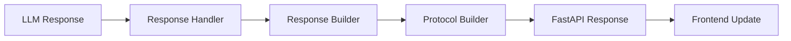

# Gaia D&D Campaign Manager - Architecture Documentation

## Table of Contents
- [Project Overview](#project-overview)
- [Project Structure](#project-structure)
- [Backend Architecture](#backend-architecture)
- [Frontend Architecture](#frontend-architecture)
- [Communication Layer](#communication-layer)
- [Data Flow](#data-flow)
- [Major Components](#major-components)
- [Development Workflow](#development-workflow)

## Project Overview

Gaia is a D&D Campaign Manager built with a **modern web architecture** featuring:
- **Backend**: FastAPI (Python) with async/await patterns
- **Frontend**: React (Vite) with modern JavaScript
- **Communication**: RESTful APIs + Protocol Buffers for structured data
- **AI Integration**: OpenAI Agents framework with multiple specialized AI agents
- **Real-time Features**: WebSocket-ready architecture for future expansion

## Project Structure

```
Gaia/
├── 📁 src/                           # Backend Python source code
│   ├── 📁 api/                       # FastAPI web server & endpoints
│   ├── 📁 core/                      # Core functionality modules
│   │   ├── 📁 agent_orchestration/   # Orchestrator implementation
│   │   ├── 📁 agents/                # Agent configurations
│   │   ├── 📁 audio/                 # Audio services (TTS, STT)
│   │   ├── 📁 campaign/              # Campaign management
│   │   ├── 📁 image/                 # Image generation services
│   │   ├── 📁 llm/                   # LLM provider management
│   │   └── 📁 session/               # Session and persistence
│   ├── 📁 engine/                    # Game engine components
│   ├── 📁 game/                      # D&D-specific logic
│   │   └── 📁 dnd_agents/            # Specialized D&D AI agents
│   ├── 📁 utils/                     # Utility modules
│   ├── 📁 frontend/                  # Frontend React application
│   │   ├── 📁 app/                   # Main app components
│   │   ├── 📁 components/            # React components
│   │   ├── 📁 services/              # Frontend services
│   │   └── 📁 hooks/                 # React hooks
│
├── 📁 scripts/                       # Development & utility scripts
│   ├── 📁 claude_helpers/            # Claude Code test scripts
│   └── 📁 cursor_helpers/            # Cursor IDE test scripts
├── 📁 campaigns/                     # Campaign data storage
├── 📁 examples/                      # Example content & demos
├── 📁 test/                          # Test suites
├── 📁 docs/                          # Documentation
├── 📄 start_gaia_launcher.py                  # Unified startup script
├── 📄 requirements.txt               # Python dependencies
└── 📄 CLAUDE.md                      # Claude Code guidelines
```

## Backend Architecture

### Core Architecture Pattern
The backend follows a **layered architecture** with clear separation of concerns:

```
┌─────────────────────────────────────────┐
│             FastAPI Layer              │  ← HTTP endpoints, middleware
├─────────────────────────────────────────┤
│          Orchestration Layer           │  ← Campaign logic, agent coordination
├─────────────────────────────────────────┤
│             Agent Layer                │  ← Specialized AI agents
├─────────────────────────────────────────┤
│           Provider Layer               │  ← LLM providers, external services
└─────────────────────────────────────────┘
```

### Major Backend Modules

#### 1. **API Layer** (`src/api/`)
- **`main.py`** - FastAPI application entry point
  - HTTP endpoints (`/api/chat`, `/api/new-campaign`)
  - TTS endpoints (`/api/tts/synthesize`)
  - STT endpoints (`/api/transcribe/*`)
  - WebSocket endpoints (`/ws/transcribe`)
  - CORS configuration and middleware
  
- **`campaign_endpoints.py`** - Campaign management endpoints
  - Campaign CRUD operations
  - Context management
  - Campaign state handling

- **`response_parser.py`** - Response parsing utilities
  - Extracts structured data from agent responses
  - Handles various response formats
  - Error recovery

- **`response_builder.py`** - Response construction utilities
  - Builds protocol-compliant responses
  - Handles error responses
  - Message formatting

- **`websocket_handlers.py`** - WebSocket communication
  - Real-time audio streaming
  - Live transcription updates
  - Session management

#### 2. **Orchestration Layer** (`src/core/agent_orchestration/`)
- **`orchestrator.py`** - Unified campaign orchestrator
  - **Agent coordination**: Manages multiple AI agents with automatic handoffs
  - **Session management**: Maintains conversation state and history
  - **Campaign execution**: Coordinates D&D game sessions
  - **Model provider abstraction**: Works with Ollama, Claude, and Parasail providers
  - **No deferred initialization**: All components ready on startup

#### 3. **Agent Layer** (`src/game/dnd_agents/`)
Built on the **agents library** with specialized D&D agents:

- **`dungeon_master.py`** - Primary DM agent
  - Narrative generation and storytelling
  - Rule interpretation and game flow
  - Player interaction management
  - Automatic handoff to specialists

- **`scenario_analyzer.py`** - Scene analysis
  - Complexity assessment
  - Context understanding  
  - Tool and approach recommendations
  - Uses llama3.1:8b for fast analysis

- **`rule_enforcer.py`** - D&D 5e rules validation
  - Rule lookup and interpretation
  - Dice roll validation
  - Game mechanics enforcement
  - Dispute resolution

- **`encounter_runner.py`** - Complex encounter management
  - Multi-phase encounter handling
  - Initiative tracking
  - Combat flow management
  - Tactical decision support

- **`turn_runner.py`** - Combat turn management
  - Turn order tracking
  - Action resolution
  - Status effect management

- **`output_formatter.py`** - Response formatting
  - Structured JSON output (narrative, turn, status, characters)
  - Consistent formatting for UI
  - Uses Claude 3.5 Sonnet for quality

- **`image_generator.py`** - Image generation
  - Scene and character visualization
  - Integration with Gemini and Parasail
  - Prompt optimization

- **`summarizer.py`** - Session summarization
  - Campaign history summaries
  - Key event tracking
  - Context compression

#### 4. **Core Services** (`src/core/`)

**Audio Services** (`src/core/audio/`):
- **`elevenlabs_stt_service.py`** - ElevenLabs Speech-to-Text
- **`tts_service.py`** - Multi-provider TTS (Parler-TTS, OpenAI, local)
- **`auto_tts_service.py`** - Automatic DM narration
- **`voice_registry.py`** - Centralized voice profiles
- **`audio_queue_manager.py`** - Audio playback queue management
- **`whisper_service.py`** - Legacy Whisper support (not initialized)

**Campaign Management** (`src/core/campaign/`):
- **`campaign_manager.py`** - Campaign lifecycle management
- **`simple_campaign_manager.py`** - Lightweight campaign operations

**Image Services** (`src/core/image/`):
- **`gemini_image_service.py`** - Google Gemini image generation
- **`parasail_image_service.py`** - Parasail image generation

**LLM Providers** (`src/core/llm/`):
- **`model_manager.py`** - Central model-to-provider mapping
- **`ollama_manager.py`** - Ollama service lifecycle
- **`model_providers.py`** - Provider configurations

**Session Management** (`src/core/session/`):
- **`campaign_runner.py`** - Campaign execution logic
- **`campaign_data_models.py`** - Data structures
- **`campaign_data_extractor.py`** - Response data extraction
- **`history_manager.py`** - Conversation history

#### 5. **Engine Layer** (`src/engine/`)
- **`dm_context.py`** - DM context management
- **`game_configuration.py`** - Game style and settings
- **`scene_manager.py`** - Scene storage and retrieval
- **`response_handler.py`** - Response processing

#### 6. **Utility Layer** (`src/utils/`)
- **`json_utils.py`** - JSON processing utilities
- **`dice.py`** - D&D dice rolling mechanics
- **`logging_utils.py`** - Centralized logging
- **`audio_utils.py`** - Audio format conversions
- **`windows_audio_utils.py`** - WSL audio passthrough

## Frontend Architecture

### Technology Stack
- **Framework**: React 18 with functional components
- **Build Tool**: Vite (fast development and builds)
- **Bundler**: RSBuild for production
- **Styling**: CSS modules with dark gaming theme
- **State Management**: React hooks and context

### Component Structure
```
src/
├── 📄 App.jsx                    # Main application component
├── 📄 main.jsx                   # React DOM entry point
├── 📁 components/                # Reusable React components
├── 📁 services/                  # API communication layer
└── 📁 assets/                    # Static assets
```

### Key Features
- **Responsive Design**: Mobile-first approach
- **Real-time Updates**: Ready for WebSocket integration
- **Component-based Architecture**: Modular, reusable components
- **Modern React Patterns**: Hooks, context, and functional components

## Communication Layer

### API Endpoints

#### RESTful JSON API
```
📡 HTTP/JSON Endpoints:
├── GET  /api/health              # Health check
├── POST /api/test                # Connectivity test
├── POST /api/chat             # Send campaign message
├── POST /api/new-campaign     # Start new campaign
├── POST /api/tts/synthesize      # Text-to-speech generation
├── GET  /api/tts/voices          # Available TTS voices
├── GET  /api/tts/auto/status     # Auto-TTS configuration
├── POST /api/tts/auto/toggle     # Toggle auto-TTS
├── POST /api/transcribe/upload   # Upload audio for transcription
├── GET  /api/transcribe/session/{id}  # Get transcription
├── GET  /api/campaigns           # List campaigns
├── POST /api/campaigns           # Create campaign
├── GET  /api/campaigns/{id}      # Get campaign details
└── DELETE /api/campaigns/{id}   # Delete campaign
```

#### WebSocket Endpoints
```
🔌 WebSocket Endpoints:
└── WS   /ws/transcribe          # Real-time audio transcription
```

### Data Flow Examples

#### Chat Message Flow
```
Frontend → POST /api/chat → Orchestrator → Agent Handoffs → LLM Provider
    ↑                                                                ↓
    ← StructuredGameData ← Response Parser ← Response Handler ← Agent Response
```

#### New Campaign Flow
```
Frontend → POST /api/new-campaign → Orchestrator → DM Agent
    ↑                                                      ↓
    ← Campaign Setup ← Response Builder ← Initial Scene ← Opening Narrative
```

## Data Flow

### 1. **Request Processing**


### 2. **Response Processing**


### 3. **Session Management**
- **Session State**: Maintained in the Orchestrator
- **Conversation History**: Stored in memory with persistent logging
- **Agent Context**: Shared across specialized agents
- **Campaign Data**: Structured storage in `campaigns/` directory

## Major Components

### Unified Orchestrator
**Purpose**: Central coordination engine for D&D campaigns

**Key Features**:
- **Single Implementation**: Unified `Orchestrator` class (no variants)
- **Agent Management**: Coordinates specialized D&D agents with automatic handoffs
- **Session State**: Maintains campaign progression and history
- **No Deferred Init**: All components initialized on startup
- **Provider Support**: Works with Ollama, Claude, and Parasail

**Key Methods**:
- `run_campaign(message)` - Process player input
- `start_new_campaign()` - Initialize new D&D session
- `get_conversation_history()` - Retrieve session history

### Campaign Runner
**Purpose**: Manages individual campaign execution

**Key Responsibilities**:
- **Scenario Analysis**: Understands player intent and scene complexity
- **Agent Selection**: Chooses appropriate agents for responses
- **Response Processing**: Handles agent outputs and formatting

### AI Agent Framework
**Purpose**: Specialized D&D knowledge and capabilities

**Agent Specializations**:
- **DungeonMaster**: Primary storytelling and rule interpretation
- **ScenarioAnalyzer**: Analyzes complexity and recommends tools/approach
- **RuleEnforcer**: D&D 5e rule validation and dispute resolution
- **EncounterRunner**: Complex multi-phase encounter management
- **TurnRunner**: Combat initiative and turn order management
- **OutputFormatter**: Structures responses into JSON format
- **ImageGenerator**: Scene and character visualization
- **Summarizer**: Campaign history and context compression

### Response Processing Pipeline
**Purpose**: Converts raw LLM outputs to structured game data

**Pipeline Stages**:
1. **Raw Response** - Unstructured text from LLM
2. **JSON Extraction** - Parse structured data
3. **Validation** - Ensure data integrity
4. **Protocol Building** - Convert to protocol buffer format
5. **Client Response** - Send to frontend

## Development Workflow

### Starting the Application
```bash
# Unified startup (handles both frontend and backend)
python start_gaia_launcher.py

# OR use platform-specific scripts
bash start_gaia.sh      # Linux/macOS/WSL
start_gaia.bat          # Windows
```

### Development Features
- **Auto-reload**: Both frontend (Vite) and backend (uvicorn) watch for changes
- **Hot Module Replacement**: Frontend updates without page refresh
- **API Documentation**: Available at `http://localhost:8000/docs`
- **Concurrent Development**: Frontend (port 3000) and backend (port 8000) run simultaneously

### Architecture Benefits

1. **Modularity**: Clear separation between frontend, backend, and AI components
2. **Scalability**: Agent-based architecture allows easy addition of new capabilities
3. **Flexibility**: Multiple communication protocols (JSON + Protocol Buffers)
4. **Performance**: Async/await patterns and efficient data serialization
5. **Maintainability**: Well-organized codebase with clear responsibilities
6. **Extensibility**: Plugin-like agent system for adding new D&D features

### Future Expansion Points

- **WebSocket Support**: Real-time multiplayer capabilities
- **Plugin System**: Community-contributed agents and features
- **Database Integration**: Persistent campaign storage
- **Authentication**: User accounts and campaign sharing
- **Advanced Audio**: Enhanced TTS providers and STT capabilities
- **Mobile Support**: Progressive web app capabilities
- **AI Model Expansion**: Support for additional LLM providers 