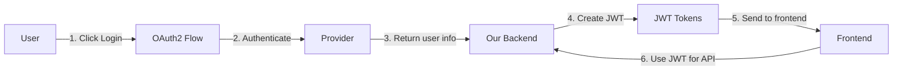

# Authentication Architecture

## Overview

Gaia uses a modern authentication system combining OAuth2 for third-party login and JWT for session management. This provides secure, passwordless authentication while maintaining efficient API access.

## Key Concepts

### OAuth2 vs JWT - Understanding the Difference

These are complementary technologies that serve different purposes in our authentication system:

#### OAuth2 - The Authorization Protocol
**Purpose**: Handles HOW users log in and grant permissions

- **What it is**: A protocol/standard for authorization delegation
- **Role**: Allows users to log in using existing accounts (Google, GitHub, Discord)
- **Key benefit**: We never handle or store user passwords
- **Process**: 
  1. User chooses provider (e.g., "Login with Google")
  2. Redirected to provider's login page
  3. User authenticates with provider
  4. Provider asks for permission to share user info
  5. Provider sends us an authorization code
  6. We exchange code for user profile data

#### JWT (JSON Web Token) - The Token Format
**Purpose**: Handles HOW we maintain user sessions

- **What it is**: A secure, self-contained token format
- **Role**: Proves user is authenticated without database lookups
- **Key benefit**: Stateless authentication - fast and scalable
- **Structure**:
  ```
  Header.Payload.Signature
  
  Payload contains:
  {
    "sub": "user_id",
    "email": "user@example.com",
    "is_admin": false,
    "exp": 1737500000
  }
  ```

#### How They Work Together



### Real-World Analogy

Think of entering a secure office building:

1. **OAuth2** = The security desk where you show your government ID
   - Proves who you are using trusted third-party identification
   - One-time verification process

2. **JWT** = The visitor badge you receive
   - Allows you to move around the building
   - Contains your info (name, access level, expiry)
   - Security can verify the badge without calling the front desk

## Authentication Flow

### 1. Initial Login (OAuth2)

```
User                    Frontend                 Backend                Provider (Google)
 |                         |                        |                        |
 |--Click "Login"--------->|                        |                        |
 |                         |--GET /auth/login------>|                        |
 |                         |<--Redirect URL---------|                        |
 |<---Redirect to Google---|                        |                        |
 |                         |                        |                        |
 |--Login to Google--------|------------------------|----------------------->|
 |<--Authorize Gaia--------|------------------------|------------------------|
 |--Grant Permission-------|------------------------|----------------------->|
 |                         |                        |<---Code + User Info----|
 |                         |<--JWT Tokens-----------|                        |
 |<---Store & Redirect-----|                        |                        |
```

### 2. API Requests (JWT)

```
Frontend                           Backend
   |                                 |
   |--API Request------------------>|
   |  Authorization: Bearer <JWT>   |
   |                                 |
   |                            Verify JWT
   |                            Extract user
   |                            Process request
   |                                 |
   |<--Response----------------------|
```

### 3. Token Refresh

```
Frontend                           Backend
   |                                 |
   |--Refresh Token---------------->|
   |                                 |
   |                            Verify refresh token
   |                            Generate new JWT
   |                                 |
   |<--New Access Token-------------|
```

## Security Architecture

### Token Types

1. **Access Token** (JWT)
   - Short-lived: 1 hour
   - Used for API requests
   - Contains user info and permissions
   - Stateless verification

2. **Refresh Token** (JWT)
   - Long-lived: 7 days
   - Used only to get new access tokens
   - Minimal payload for security
   - Can be revoked server-side

### Security Measures

1. **OAuth2 Security**
   - State parameter for CSRF protection
   - Secure redirect URI validation
   - Authorization code is single-use
   - HTTPS required in production

2. **JWT Security**
   - Signed with secret key (HS256)
   - Short expiration times
   - Secure storage (httpOnly cookies planned)
   - Token rotation on refresh

3. **Additional Measures**
   - Rate limiting on auth endpoints
   - Audit logging for security events
   - IP address tracking
   - User agent validation

## Database Schema

### Authentication Tables

```sql
-- Users table (auth schema)
auth.users
├── user_id (UUID, PK)
├── email (unique)
├── username
├── display_name
├── avatar_url
├── is_active
├── is_admin
└── metadata (JSONB)

-- OAuth accounts (auth schema)
auth.oauth_accounts
├── account_id (UUID, PK)
├── user_id (FK)
├── provider (google/github/discord)
├── provider_account_id
├── access_token (encrypted)
├── refresh_token (encrypted)
└── expires_at

-- Sessions (auth schema)
auth.sessions
├── session_id (UUID, PK)
├── user_id (FK)
├── token_hash
├── expires_at
├── ip_address
└── user_agent

-- Access control (auth schema)
auth.access_control
├── access_id (UUID, PK)
├── user_id (FK)
├── resource_type
├── resource_id
├── permission_level (read/write/admin)
└── granted_by (FK)
```

## API Endpoints

### Public Endpoints
- `GET /api/auth/providers` - List available OAuth2 providers
- `GET /api/auth/login/{provider}` - Start OAuth2 flow
- `GET /api/auth/callback/{provider}` - OAuth2 callback
- `POST /api/auth/refresh` - Refresh access token

### Protected Endpoints
- `GET /api/auth/me` - Get current user info
- `POST /api/auth/logout` - Logout and clear sessions

### Admin Endpoints
- `GET /api/admin/users` - List all users
- `PUT /api/admin/users/{id}` - Update user
- `DELETE /api/admin/users/{id}` - Delete user

## Frontend Integration

### Authentication State

```typescript
interface AuthState {
  user: User | null;
  isAuthenticated: boolean;
  isLoading: boolean;
  accessToken: string | null;
  refreshToken: string | null;
}
```

### Protected Routes

```jsx
<Route path="/app" element={
  <RequireAuth>
    <GameDashboard />
  </RequireAuth>
} />
```

### API Client

```javascript
// Automatic token attachment
api.interceptors.request.use(config => {
  const token = getAccessToken();
  if (token) {
    config.headers.Authorization = `Bearer ${token}`;
  }
  return config;
});

// Automatic token refresh
api.interceptors.response.use(
  response => response,
  async error => {
    if (error.response?.status === 401) {
      const newToken = await refreshAccessToken();
      if (newToken) {
        return api.request(error.config);
      }
    }
    return Promise.reject(error);
  }
);
```

## Configuration

### Required Environment Variables

```bash
# OAuth2 Providers
GOOGLE_CLIENT_ID=your-google-client-id
GOOGLE_CLIENT_SECRET=your-google-client-secret
GITHUB_CLIENT_ID=your-github-client-id
GITHUB_CLIENT_SECRET=your-github-client-secret
DISCORD_CLIENT_ID=your-discord-client-id
DISCORD_CLIENT_SECRET=your-discord-client-secret

# JWT Configuration
JWT_SECRET_KEY=your-secret-key-min-32-chars
JWT_ACCESS_TOKEN_EXPIRE_MINUTES=60
JWT_REFRESH_TOKEN_EXPIRE_DAYS=7

# URLs
FRONTEND_URL=http://localhost:5173
BACKEND_URL=http://localhost:8000
```

## Benefits of This Architecture

1. **No Password Management**
   - Users don't create another password
   - We don't store passwords
   - Reduced security liability

2. **Fast Authorization**
   - JWT validation is cryptographic (no DB lookup)
   - User info embedded in token
   - Scales horizontally

3. **Provider Flexibility**
   - Easy to add new OAuth2 providers
   - Users can link multiple accounts
   - Fallback options if one provider is down

4. **Security**
   - Industry-standard protocols
   - Token rotation and expiry
   - Audit logging
   - Fine-grained permissions

## Future Enhancements

- [ ] Add local authentication option (email/password)
- [ ] Implement 2FA for admin accounts
- [ ] Add API key authentication for services
- [ ] Implement WebAuthn for passwordless login
- [ ] Add social account linking
- [ ] Implement organization/team management
- [ ] Add OAuth2 authorization server for third-party apps