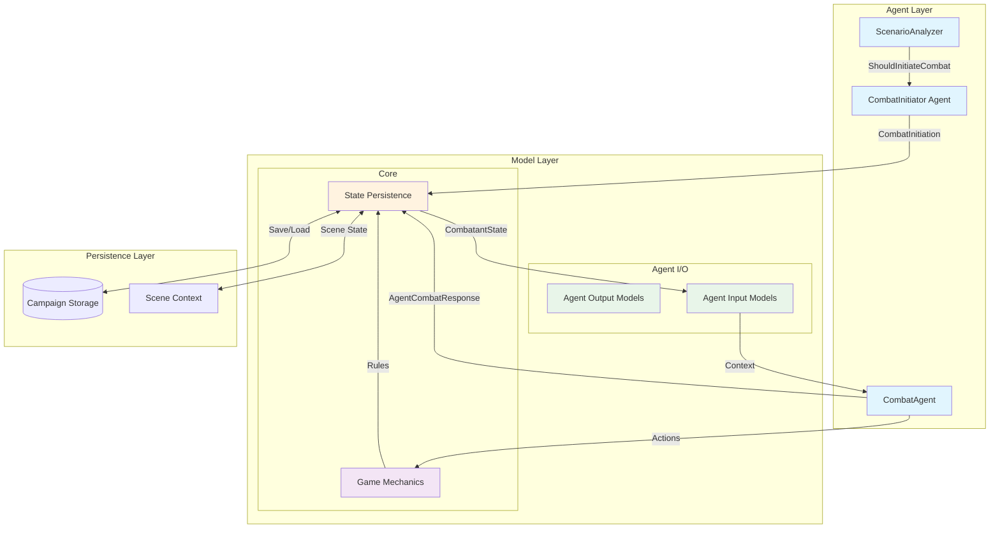
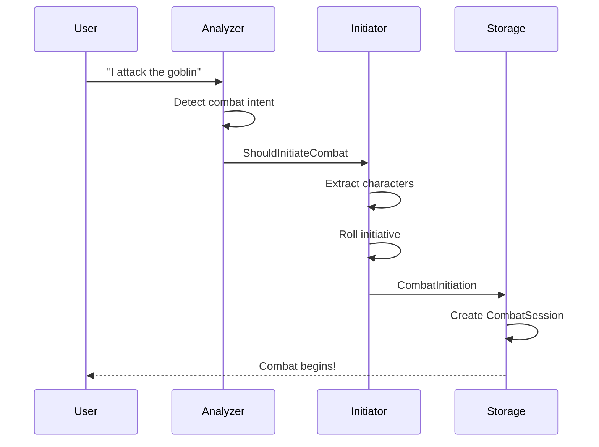
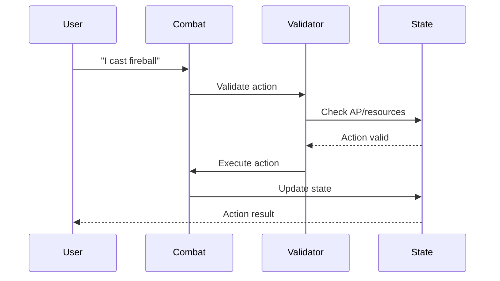

# Combat Models Architecture

## Overview
The combat system uses a layered data model architecture to manage D&D 5e combat mechanics, agent communication, and state persistence. This document describes the current organization and proposed refactoring.

## Current Structure Analysis

### Directory Organization
```
core/models/combat/
├── initiation/       # Combat setup and initialization
├── fight/            # Combat execution and updates
└── (root)           # Core mechanics and persistence
```

## Model Categories by Usage

### 1. State Persistence Models
**Purpose**: Store and maintain game state across turns and sessions

| Model | Location | Purpose |
|-------|----------|---------|
| `CombatSession` | `/combat/` | Master container for entire combat encounter |
| `CombatantState` | `/combat/` | Individual combatant status and attributes |
| `BattlefieldState` | `/combat/` | Environmental state and map data |
| `Position` | `/combat/` | Spatial coordinates and movement |
| `StatusEffect` | `/combat/` | Active buffs/debuffs on combatants |
| `ActionPointState` | `/combat/` | Action point tracking per combatant |

### 2. Agent Output Models
**Purpose**: Structure responses from AI agents

| Model | Location | Purpose |
|-------|----------|---------|
| `CombatInitiation` | `/initiation/` | Combat setup from CombatInitiator |
| `AgentCombatResponse` | `/fight/` | Combat agent action responses |
| `CombatSummary` | `/fight/` | End-of-combat summaries |
| `ShouldInitiateCombat` | `/initiation/` | Analyzer decision output |

### 3. Agent Input Models
**Purpose**: Provide context to AI agents

| Model | Location | Purpose |
|-------|----------|---------|
| `InitiativeEntry` | `/initiation/` | Turn order information |
| `CombatConditions` | `/initiation/` | Environmental modifiers |
| `CombatNarrative` | `/initiation/` | Scene descriptions |
| `AgentCombatAction` | `/fight/` | Player action requests |
| `CharacterCombatStatus` | `/fight/` | Character state snapshot |
| `BattlefieldConfig` | `/initiation/` | Battlefield setup parameters |

### 4. Mechanics Models
**Purpose**: Define game rules and calculations

| Model | Location | Purpose |
|-------|----------|---------|
| `ActionDefinitions` | `/combat/` | Available actions and AP costs |
| `CombatAction` | `/fight/` | Action resolution logic |
| `CombatStats` | `/fight/` | Combat calculations |
| `CombatStateUpdate` | `/fight/` | State transition rules |
| `Enums` | `/combat/` | Game constants and types |

## Architecture Diagram



## Data Flow

### Combat Initiation Flow


### Combat Turn Flow


## Proposed Refactoring

### Cleaner Category Structure
```
core/models/combat/
├── persistence/      # State management
│   ├── session.py
│   ├── combatant.py
│   ├── battlefield.py
│   └── effects.py
├── agent_io/        # Agent communication
│   ├── inputs/
│   │   ├── context.py
│   │   └── actions.py
│   └── outputs/
│       ├── responses.py
│       └── summaries.py
├── mechanics/       # Game rules
│   ├── actions.py
│   ├── calculations.py
│   └── validators.py
└── types/          # Shared types
    ├── enums.py
    └── primitives.py
```

### Benefits of Refactoring

1. **Clear Separation of Concerns**
   - Persistence models handle storage only
   - Agent I/O models handle communication only
   - Mechanics models handle rules only

2. **Reduced Coupling**
   - Models don't mix responsibilities
   - Cleaner dependency graph
   - Easier testing

3. **Better Discoverability**
   - Clear directory naming
   - Logical grouping
   - Self-documenting structure

## Usage Guidelines

### For State Management
```python
from core.models.combat.persistence import CombatSession, CombatantState

# Load combat state
session = CombatSession.from_dict(stored_data)

# Update state
session.combatants[char_id].hp -= damage

# Persist changes
storage.save(session.to_dict(compact=True))
```

### For Agent Communication
```python
from core.models.combat.agent_io import CombatContext, CombatResponse

# Prepare context for agent
context = CombatContext(
    session=session,
    current_turn=combatant,
    available_actions=actions
)

# Process agent response
response = agent.process(context)
result = CombatResponse.from_agent_output(response)
```

### For Game Mechanics
```python
from core.models.combat.mechanics import ActionValidator, DamageCalculator

# Validate action
validator = ActionValidator(session)
if validator.can_perform(action, combatant):
    # Calculate effects
    damage = DamageCalculator.calculate(action, combatant, target)
    # Apply results
    target.hp -= damage
```

## Model Relationships

### Dependency Hierarchy
1. **Types** (no dependencies)
   - Enums, basic data classes

2. **Mechanics** (depends on Types)
   - Action definitions, calculations

3. **Persistence** (depends on Types, Mechanics)
   - State containers, serialization

4. **Agent I/O** (depends on all above)
   - Formatting, transformation

### Key Interfaces

| Interface | Purpose | Methods |
|-----------|---------|---------|
| `Persistable` | Serialization | `to_dict()`, `from_dict()` |
| `Validatable` | Rule checking | `validate()`, `is_valid()` |
| `Executable` | Action processing | `execute()`, `can_execute()` |

## Migration Path

### Phase 1: Documentation
- [x] Document current structure
- [x] Identify dependencies
- [x] Plan new structure

### Phase 2: Create New Structure
- [ ] Create new directories
- [ ] Add base interfaces
- [ ] Create type definitions

### Phase 3: Migrate Models
- [ ] Move persistence models
- [ ] Move agent I/O models
- [ ] Move mechanics models
- [ ] Update imports

### Phase 4: Validation
- [ ] Run tests
- [ ] Verify agent functionality
- [ ] Check persistence

## Best Practices

### Model Design
1. **Single Responsibility** - Each model has one clear purpose
2. **Immutability** - Prefer immutable data classes where possible
3. **Validation** - Validate at boundaries (agent I/O, persistence)
4. **Serialization** - Use `compact=True` for storage, full for APIs

### Naming Conventions
- **State Models**: `*State`, `*Session`
- **Agent Outputs**: `*Response`, `*Result`
- **Agent Inputs**: `*Context`, `*Request`
- **Mechanics**: `*Action`, `*Effect`, `*Validator`

### Testing Strategy
- **Unit Tests**: Mechanics calculations
- **Integration Tests**: State transitions
- **Contract Tests**: Agent I/O formats
- **End-to-End**: Complete combat scenarios

## Conclusion

The combat model architecture serves as the backbone of the D&D combat system. By clearly separating concerns into persistence, agent I/O, and mechanics, we can maintain a robust and extensible combat engine that supports both real-time gameplay and persistent campaign states.