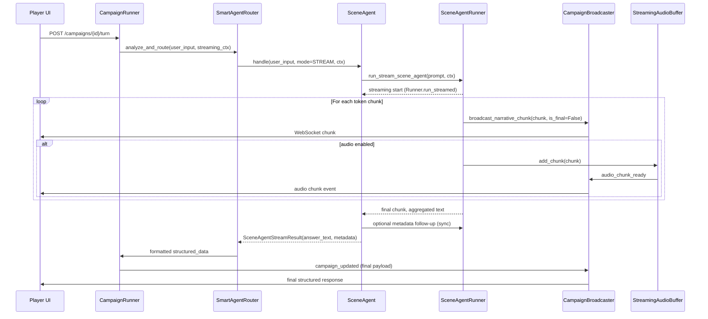

# Scene Agent Streaming Transition Proposal

## Summary
- Introduce a dual-mode execution model for scene agents so they can return structured JSON in synchronous contexts or emit conversational text when streaming is enabled.
- Reuse the existing Agents SDK streaming flow (mirroring `StreamingDMRunner`) to ensure tool support, guardrails, and telemetry remain consistent.
- Preserve downstream persistence, turn-management, and frontend handling by reconstructing structured metadata once streaming completes.

## Goals
- Deliver responsive scene agent updates over the campaign WebSocket with the same UX as the streaming DM.
- Maintain current JSON payload shape for history storage, turn advancement, and analytics.
- Avoid bespoke integrations with `streaming_llm_client`; rely on `Runner.run_streamed` for guardrails and tool usage.
- Keep behavior togglable per request so API clients can opt in or out of streaming safely.

## Current Pain Points
- Scene agents only operate in synchronous mode, returning JSON payloads that are transformed into player answers later.
- Attempting to stream the formatted JSON creates lag and awkward UX because the answer is constructed post-hoc.
- Ad-hoc streaming via raw LLM clients would lose tool execution, output validation, and retry logic.
- The router lacks a mechanism to propagate streaming intent or WebSocket context down to agents.

## Proposed Architecture

### 1. Execution Modes
- Add a `SceneAgentMode` enum (`SYNC`, `STREAM`) and a `SceneStreamingContext` dataclass containing `session_id`, `broadcaster`, optional audio flags.
- Update `SmartAgentRouter.analyze_and_route` and `CampaignRunner.run_turn` to accept a streaming flag/context and forward it to invoked scene agents.

### Architecture Diagrams

#### High-Level Component Flow
```mermaid
flowchart TD
    subgraph Client
        UI[Player UI]
    end

    subgraph Backend
        CR[CampaignRunner]
        SR[SmartAgentRouter]
        SA[Scene Agent (Dialog/Exploration/Action)]
        SAR[Scene Agent Runner]
        BRO[CampaignBroadcaster]
        TTS[StreamingAudioBuffer/TTS]
        STOR[Structured Data Persistence]
    end

    UI -- WebSocket connect --> BRO
    UI -- HTTP Turn Request --> CR
    CR --> SR
    SR -->|mode + streaming ctx| SA
    SA -->|prompt| SAR
    SAR -->|Runner.run_streamed events| SA
    SAR -->|chunks| BRO
    BRO -->|narrative_chunk| UI
    BRO -->|audio events| TTS
    SA -->|metadata extract| SAR
    SR -->|formatted response| CR
    CR --> STOR
    STOR -->|campaign update| BRO
```

#### Streaming Interaction Sequence


### 2. Runner Support
- Extend `scene_agent_runner` with `run_stream_scene_agent(...)`, wrapping `Runner.run_streamed` to collect text deltas while respecting tool calls.
- Provide fallback to the existing JSON execution path only when streaming is not requested or the streaming run fails hard.
- Return a consolidated `SceneAgentStreamResult` containing `answer_text`, `accumulated_chunks`, and raw tool output for post-processing.

### 3. Base Scene Agent Refactor
- Factor shared context/prompt helpers into `BaseSceneAgent`.
- Expose `generate_sync_response(...)` (current JSON path) and `stream_response(...)` (new streaming path) that share context assembly.
- Ensure `stream_response` triggers the streaming runner, captures the full textual answer, and optionally invokes a quick follow-up prompt to recover structured metadata (handoff, queue_next, rolls).

### 4. Agent Prompt Adjustments
- Split agent instructions into sync versus streaming variants:
  - Sync: keep “RESPOND WITH JSON” format.
  - Streaming: instruct the model to respond with fully formatted prose (e.g., `NPC: "dialog"` or `discovery + narrative`) that matches the current player answer conventions.
- Implement post-stream metadata extraction by prompting the agent (non-stream) with its own streamed answer to fill the structured fields.

### 5. Router & Formatter Integration
- In `_route_to_{dialog,exploration,action}`, call the streaming handler when a broadcaster is available; otherwise fall back to sync mode.
- Update `_format_scene_response` to trust the preformatted `answer_text` supplied by the streaming path while still merging recovered metadata and maintaining narrative continuity.
- Support queuing follow-up agents (`queue_next`) and handoffs identically to sync mode.

### 6. WebSocket & Audio Broadcasting
- Broadcast streaming chunks through `CampaignBroadcaster` (reuse `narrative_chunk` event or add a scene-specific variant with agent metadata).
- Optionally feed chunks into `StreamingAudioBuffer` when TTS is enabled so scene agent dialogue shares the same progressive audio UX as the DM.
- Ensure frontend aggregation (`PlayerPage.jsx`) handles the new chunk stream without diverging from DM handling.

### 7. Persistence & Turn Management
- Once streaming completes, assemble the standard `structured_data` dict containing:
  - `answer` (final concatenated text),
  - `narrative` (previous scene narrative or derived text),
  - recovered metadata (`handoff_to`, `queue_next`, rolls, items),
  - turn info and status identical to sync mode.
- Persist structured data, update turn manager, and log history as today.

### 8. Fallback Behavior
- If streaming fails mid-run, fall back to non-streaming agent execution while returning an error chunk to clients and preserving consistent structured data.
- Guard against partial metadata extraction by defaulting to safe values when the follow-up prompt fails.

## Implementation Plan

1. **Infrastructure**
   - Introduce `SceneAgentMode`, `SceneStreamingContext`, and `SceneAgentStreamResult`.
   - Extend router and campaign runner signatures to accept streaming context.
   - Add `run_stream_scene_agent` helper using `Runner.run_streamed`.

2. **Base Agent Updates**
   - Refactor `BaseSceneAgent` to share context building across modes.
   - Implement `stream_response` with metadata follow-up call.

3. **Agent-Specific Work**
   - Update `DialogAgent`, `ExplorationAgent`, and `ActionResolver` to branch on mode, supply new streaming instructions, and postprocess structured fields.

4. **Routing & Formatting**
   - Teach `_route_to_*` methods to send streaming chunks and to build formatted responses directly from streamed answers.
   - Ensure `_format_scene_response` handles already-formatted answers without rewrapping.

5. **Broadcasting & Audio**
   - Reuse or extend `CampaignBroadcaster` for scene agent chunks.
   - Optionally integrate with `StreamingAudioBuffer` for TTS parity.

6. **Testing & Validation**
   - Unit-test `run_stream_scene_agent` and metadata extraction (mock Runner events).
   - Add integration tests covering streaming and sync modes via mocked broadcasters.
   - Manual QA checklist: WebSocket streaming, frontend accumulation, persistence, audio.

7. **Documentation & Rollout**
   - Update developer docs (`STREAMING_RESPONSE_MIGRATION.md`) with scene agent streaming usage.
   - Coordinate frontend adjustments if new WebSocket event types are introduced.
   - Roll out behind a feature flag, then enable per environment.

## Open Questions
- Can metadata extraction share prompts across agents, or should each agent define its own follow-up template?
- Do we need agent-specific WebSocket event types for future analytics, or is one generic chunk event sufficient?
- Should we pre-warm audio buffers for all streaming responses or only when tts is explicitly requested?

## Success Metrics
- Scene agent responses appear in the player UI with sub-second latency comparable to streaming DM.
- Stored `structured_data` remains schema-compatible with existing analytics and turn management.
- No regressions in sync mode behavior when streaming is disabled.

## Implementation Status (2025-02)
- Introduced runtime support for `SceneAgentMode` and `SceneStreamingContext` to allow routers to opt agents into streaming mode.
- Dialog agent now streams via `Runner.run_streamed`, recaptures metadata post-stream, and falls back to sync on failure.
- Exploration and action agents accept the new execution mode but currently fall back to synchronous behavior until streaming prompts are finalized.
- Smart router and campaign runner propagate streaming context, removing the temporary DM-only shortcut so scene agents run again in production pathways.
- Pending follow-up: broaden streaming prompts to additional agents, broadcast partial chunks for non-dialog agents, expand automated tests, and update frontend handling if new event types are introduced.
